# Restaurant review kata solution

## Current system

The current system could rely on:
 - one server hosting all apps and the database
 - one server for front-end apps, one for the REST API and one for the database

Let's assume we are in the second case:

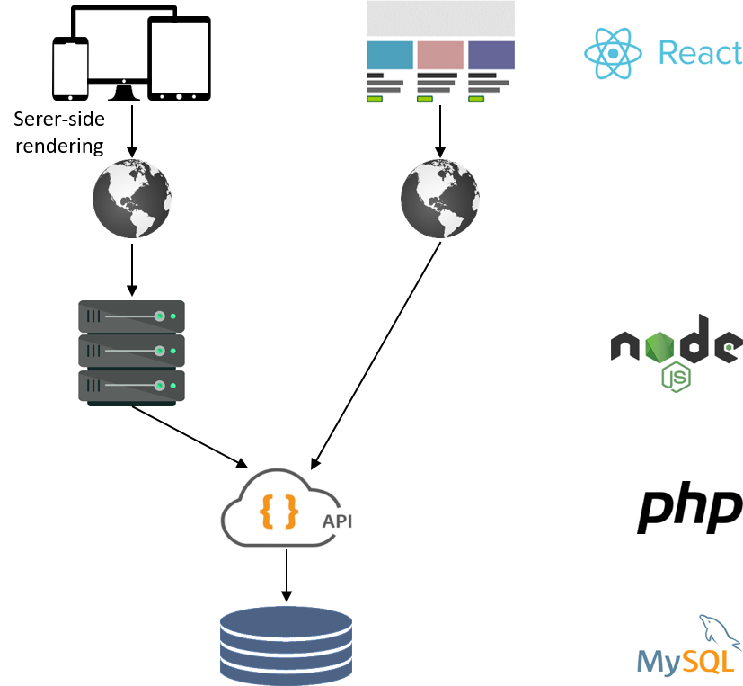

The above system does not have infrastructure redundancy and therefore availability, reliability, fault tolerance and resilience are heavily impacted and result in a high risk for the company and its brand reputation.

## Increasing redundancy

The first thing to do is to start using multiple nodes for each layer:
 - a minimum of 3 nodes is needed to have redundancy even during maintenance
 - a load balancer will be used to access the layer by means of a [VIP](https://en.wikipedia.org/wiki/Virtual_IP_address)
 - no changes to business capabilities should be performed
 - no or minimum changes to the code should be performed
 - costs will increase since the system is not yet optimized

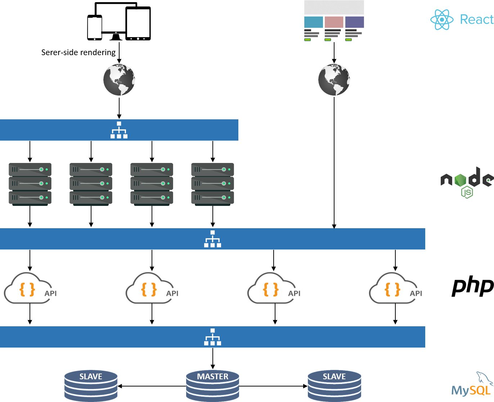

## Modularization

### Introduction

The target architecture is heavily based on modularization: the goal is taming complexity by decomposing a huge system in multiple simpler parts with only one responsibility.

Unfortunately this brings along a big increase in the overall system complexity and the challenges related to its implementation, deploy (e.g. SDLC, release management, containerization and container orchestrators like [Kubernetes](https://kubernetes.io)), handling ([observability](https://distributed-systems-observability-ebook.humio.com/)), maintenance, evolution.

It is pretty common to use [Domain-Driven Design](https://wikipedia.org/wiki/Domain-driven_design) to analyze an area of the business, a DDD subdomain, maybe with some [EventStorming](https://www.eventstorming.com) sessions, with the goal of getting a better awareness of concepts, processes and rules that belong to it and start talking all the same ubiquitous language.

Multiple subdomains cooperate by means of integration events and web APIs and even within a single subdomain it is possible to find one or more [microservices](https://microservices.io) that, whenever possible, use a [choreography rather than orchestration](https://www.thoughtworks.com/insights/blog/scaling-microservices-event-stream) integration model.

The [integration database](https://martinfowler.com/bliki/IntegrationDatabase.html) approach is abandoned in favor of [application databases](https://martinfowler.com/bliki/ApplicationDatabase.html), allowing each microservice to use a different data store: this means custom technology, [guarantees](https://www.voltdb.com/blog/2015/10/22/disambiguating-acid-cap) and decisions/settings in terms of scalability, resilience and reliability.

The implementation of a single microservice is often based on the [ports and adapters](https://web.archive.org/web/20060711221010/http://alistair.cockburn.us:80/index.php/Hexagonal_architecture) pattern also known as hexagonal architecture.

Moreover, when different use cases need different levels of scale and flexibility, the [CQRS](https://www.martinfowler.com/bliki/CQRS.html) pattern is used, resulting in different write and read models often needing polyglot persistence, sometimes in combination with [Event Sourcing](https://www.martinfowler.com/eaaDev/EventSourcing.html).

This is what goes under the term [Event-Driven Architecture](https://martinfowler.com/articles/201701-event-driven.html).

A modularization approach is usually adopted also for client applications by means of [microfrontends](https://micro-frontends.org): smaller and more manageable [pieces](https://martinfowler.com/articles/micro-frontends.html) each one implementing a different feature and communicating with an API that [insulates](https://microservices.io/patterns/apigateway.html) the caller from how the application is partitioned into microservices.

When multiple client types are supported, the [Backend For Frontend](https://samnewman.io/patterns/architectural/bff) approach can be used to provide the optimal API for each client.

Microfrontends allow to reduce page load time considerably, since each part, including the container application, is smaller and all parts load simultaneously, using the [skeleton screens](http://www.lukew.com/ff/entry.asp?1797) approach where possible.

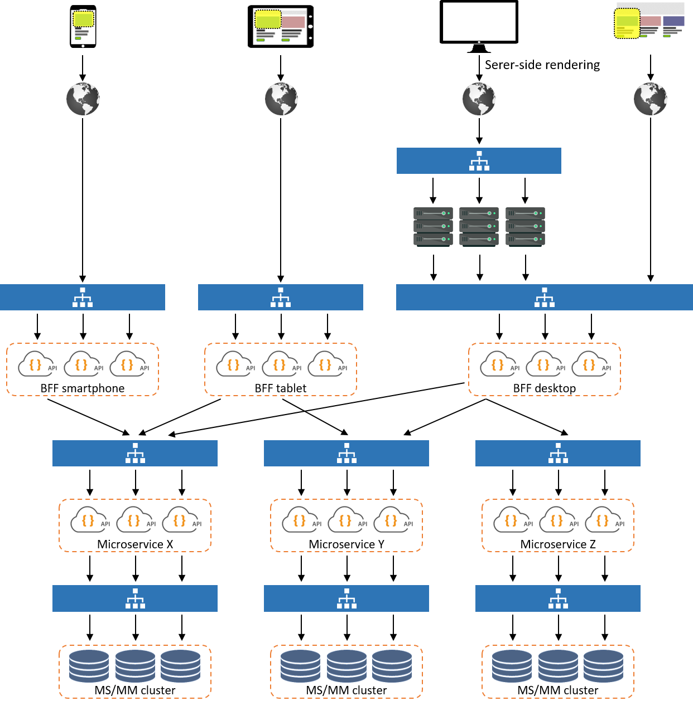

#### Easy scaling of the engineering department
It is allowed by the usage of microfrontends and microservices, since the system parts and the department verticals are in a 1:1 relationship and verticals work as independently as possible.

#### Horizontal scalability
Microservices allow to use data stores tailored to specific needs: this means that we can have scalability on reads or on writes or on both depending on the technology we choose and the topology we use.

#### Resiliency and reliability
Microservices allow to use data stores tailored to specific needs: this means that we can have master-slave or master-master replication within a single data center or across multiple data centers.

Several data stores support multiple data centers, but only few of them support master-master replication:
 - [RavenDB](https://ayende.com/blog/180323/ravendb-4-0-unsung-heroes-automatic-conflict-resolution)
 - [CockroachDB](https://www.cockroachlabs.com/blog/scaling-distributed-database/)
 - [Cassandra](http://cassandra.apache.org)
 - [Redis Enterprise](https://www.slideshare.net/mobile/RedisLabs/redisconf17-redis-labs-multimaster-redis-a-deep-dive)
 - [Neo4j](https://neo4j.com/docs/operations-manual/current/clustering/multi-data-center)
 - [AWS DynamoDB](https://docs.aws.amazon.com/amazondynamodb/latest/developerguide/Streams.CrossRegionRepl.html)
 - [Azure CosmosDB](https://docs.microsoft.com/en-us/azure/cosmos-db/multi-region-writers)

Traffic spikes can be handled by means of automatic or scheduled scaling and this is very easy when using a cloud provider.

### Microfrontends

Thinking about the business capabilities of the system it is possible to imagine how the UI looks like and identify some microfrontends.

#### Home page

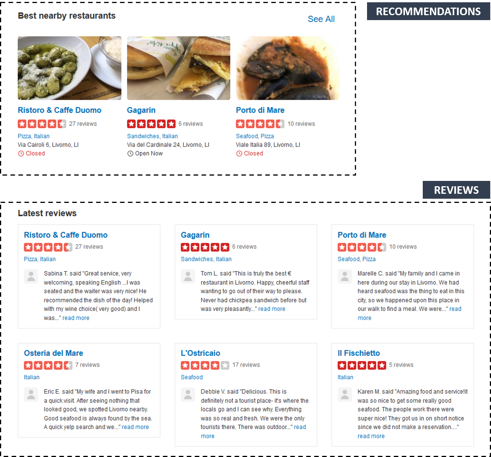

#### Restaurant profile

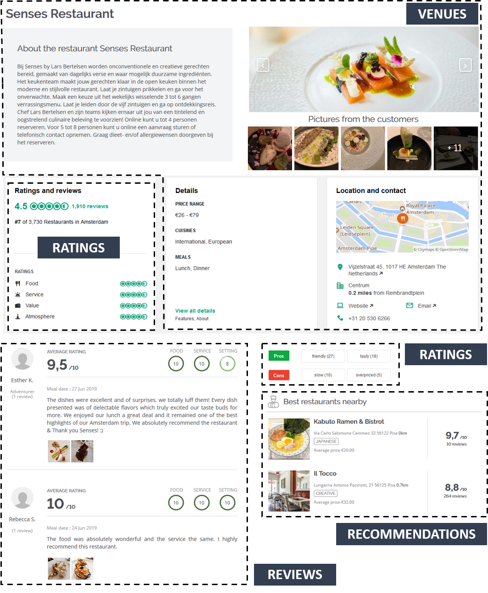

#### Search

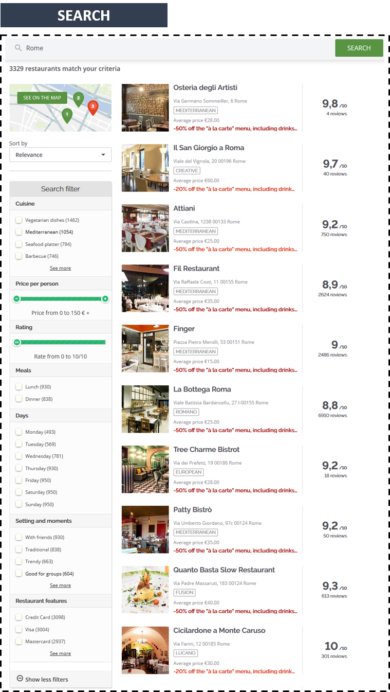

#### User profile administration

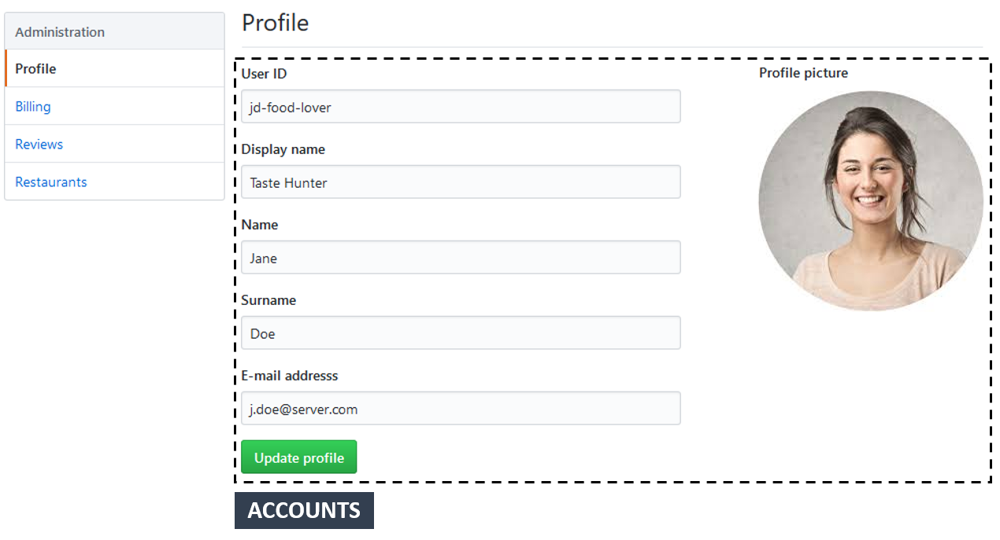

#### Billing administration

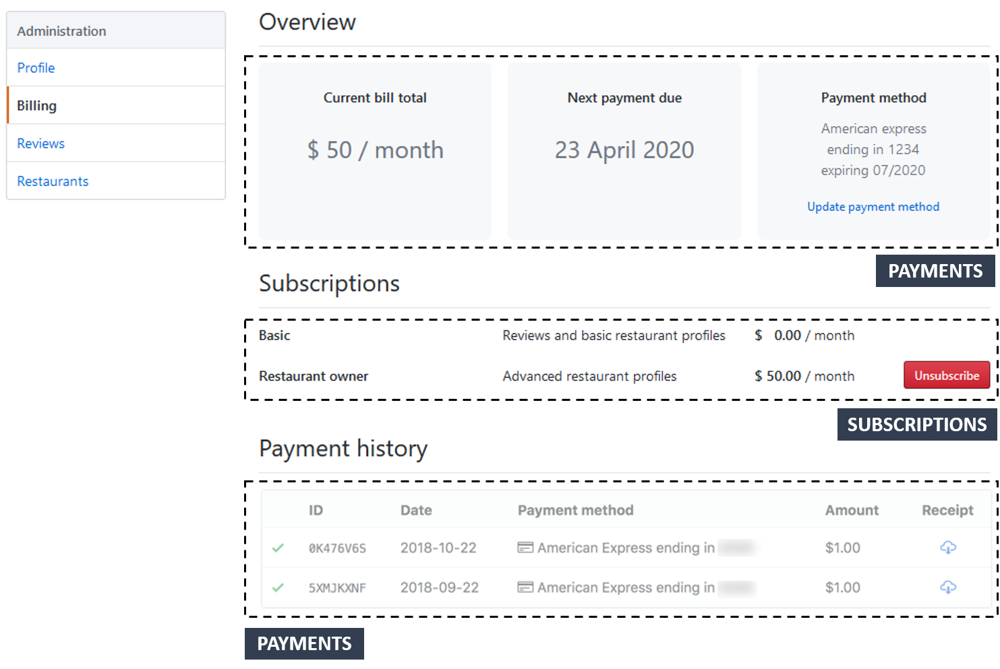

#### Review administration

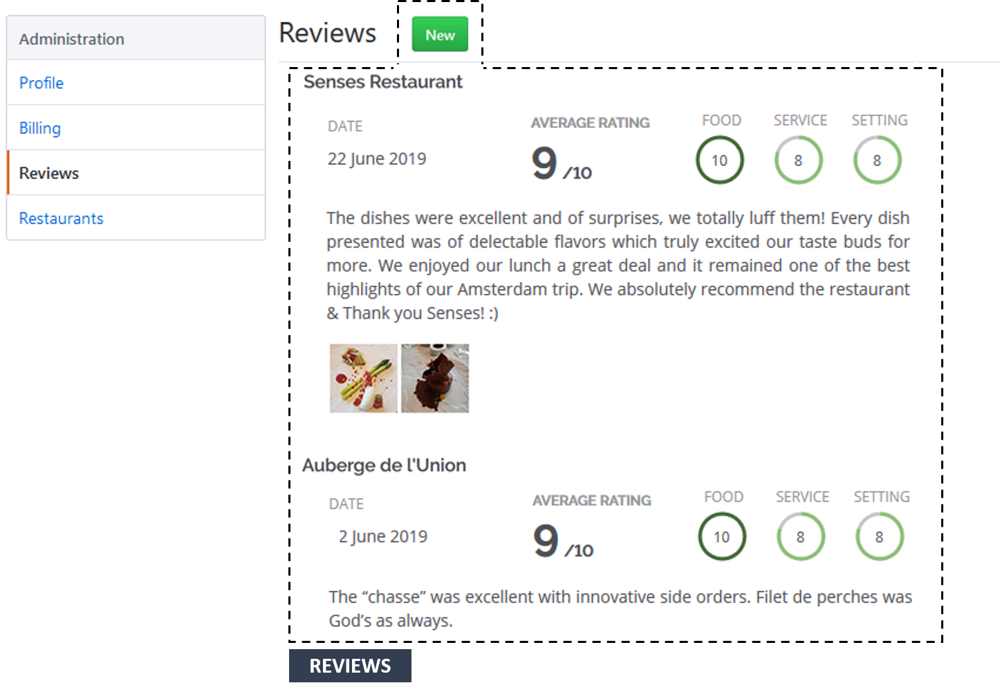

#### Restaurant administration

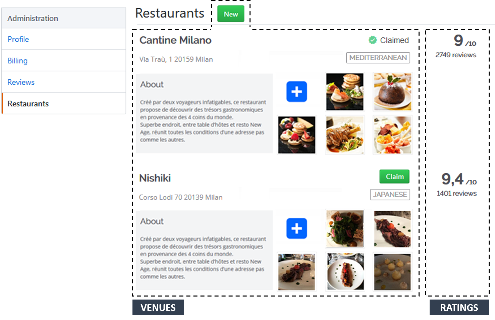

#### Subscription management (customer success)

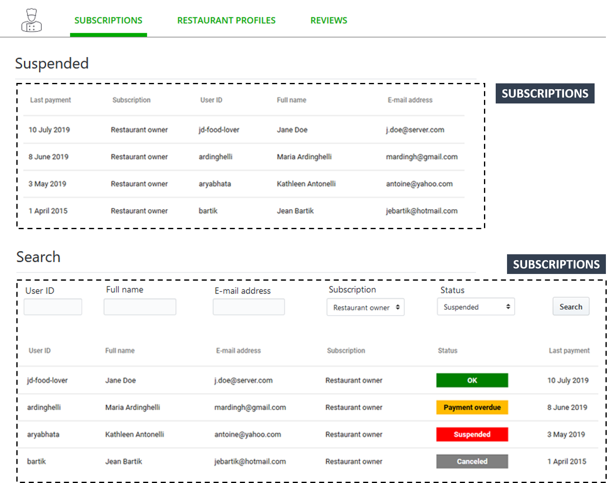

#### Restaurant profile management (customer success)

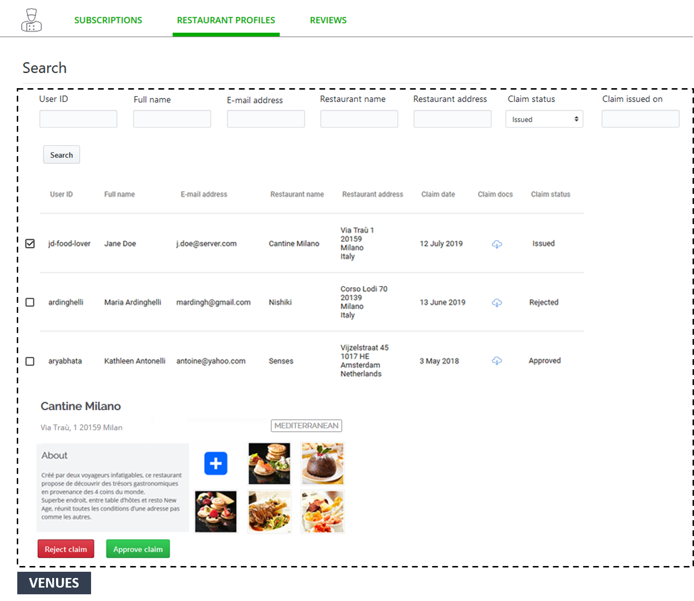

#### Review management (customer success)

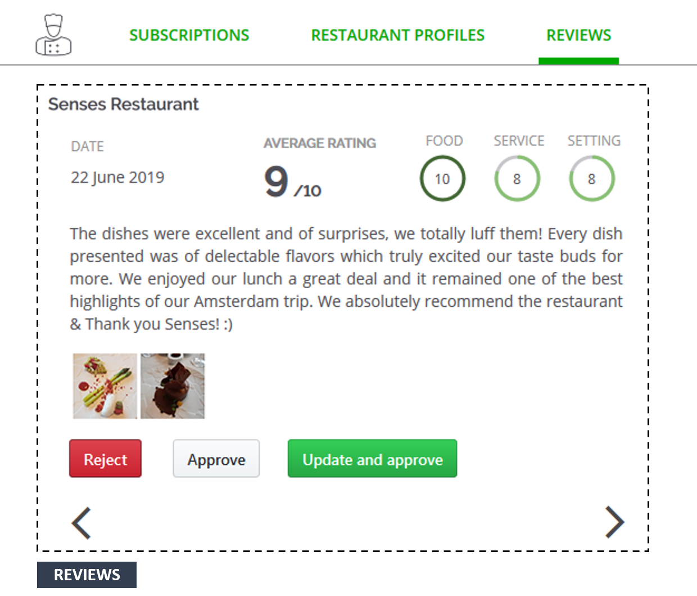

### Microservices

A high-level analysis has been performed defining a microservice for each microfrontend unless otherwise specified.

A deeper analysis of the current API and the use cases would allow to create a better design with more accurate microservices and the details of the API model.

#### Recommendations

[Machine learning](https://en.wikipedia.org/wiki/Machine_learning) is used to provide per user restaurant rankings based on user preferences and reviews.

Elasticsearch [allows](https://www.elastic.co/guide/en/elasticsearch/reference/current/geo-queries.html) to search restaurants within the radius of a specific geographical location.

The home page provides recommended restaurants close to the user location, whereas the restaurant profile page provides top restaurants nearby.

#### Reviews

Reviews are submitted and then the customer success team can reject or approve them (with or without editing).

They can be submitted from any geographical location and be related to restaurants far from the reviewer.

They are retrieved by:
 - location and status (approved), sorted by descending date (home)
 - user and status (approved), sorted by descending date (review administration)
 - restaurant and status (approved), sorted by descending date (restaurant profile)
 - status (submitted) sorted by ascending date (review management)

Photos should be stored using a cloud object storage service providing a built-in Content Delivery Network.

As for the data store there are three alternatives:
 - [MongoDB](https://www.mongodb.com) (supports [geospatial queries](https://docs.mongodb.com/manual/tutorial/geospatial-tutorial)) for a single data center
 - [RavenDB](https://ravendb.net) (supports [spatial search](https://ravendb.net/docs/article-page/4.1/csharp/indexes/querying/spatial)) for multiple data centers
 - CQRS with write model on Cassandra and read model on Elasticsearch (supports [geo queries](https://www.elastic.co/guide/en/elasticsearch/reference/current/geo-queries.html)) for multiple data centers

#### Venues / Search

Restaurants can be created by anyone, but only name and address can be inserted.

Users with a *restaurant owner* subscription can edit the other information and claim a restaurant (the customer success team can then reject or approve the claim).

They can be created from any geographical location and be related to restaurants far from the creator.

They are retrieved by:
 - id (restaurant profile)
 - location and many other criteria, sorted by location (search)
 - user (creator/owner), sorted by ascending name (restaurant administration)
 - user (creator/owner), name and claim info, sorted by name or other field (restaurant profile management)

Photos should be stored using a cloud object storage service providing a built-in Content Delivery Network.

The **locator service** provides the search capability relying on Elasticsearch and it is scaled differently to handle the heavy search load.

The **restaurant service** covers the other use cases and, as for the data store, there are three alternatives:
 - [MongoDB](https://www.mongodb.com) (supports [geospatial queries](https://docs.mongodb.com/manual/tutorial/geospatial-tutorial)) for a single data center
 - [RavenDB](https://ravendb.net) (supports [spatial search](https://ravendb.net/docs/article-page/4.1/csharp/indexes/querying/spatial)) for multiple data centers
 - CQRS with write model on Cassandra and read model on Elasticsearch (supports [geo queries](https://www.elastic.co/guide/en/elasticsearch/reference/current/geo-queries.html)) for multiple data centers

#### Ratings

After a review is approved:
 - NLP is used to extract positive/negative aspects from a review with aspect-based sentiment analysis
 - aggregation operations compute average ratings, number of reviews and the most frequent weighted pros and cons (restaurant profile and restaurant administration)

To allow aggregation to be performed in near real-time a stream processing solution like [Flink](https://flink.apache.org) should be used.

#### Accounts

Account information is edited and retrieved rarely therefore a bigger latency is tolerated and a master-slave data store is enough (sharding can be used if better performances are needed).

#### Payments

The **money service** provides the integration with one of the most used payment gateways:
 - [Stripe](https://stripe.com) (no PayPal support)
 - [Braintree](https://www.braintreepayments.com)

It stores payment method configuration, payment frequency and the amount due.

The **invoicing service** keeps track of payments and invoices.

Both services can use a master-slave data store since information is modified rarely and read more often.

#### Subscriptions

On completion of a successful payment subscription is completed successfully: the service keeps track of user subscriptions, last payment date and implement basic subscription status workflows.

A master-slave data store can be used since information is accessed mostly on read.

## SDLC

### Continuous integration
[Continuous integration](http://www.martinfowler.com/articles/continuousIntegration.html) is the practice of merging all developer work with a shared mainline several times a day so that all changes can be tested to work together and integration problems can be avoided relying on automated tests.

If necessary, partially complete features can be released in a disabled state using feature toggles or the branch by abstraction technique.

### Continuous delivery
[Continuous delivery](http://www.amazon.com/dp/0321601912) is a software engineering approach in which teams keep producing valuable software in short cycles resulting in the ability to rapidly, reliably and repeatedly push out enhancements and bug fixes to customers at low risk and with minimal manual overhead (regular deployments to production are part of the process)

CD treats the commonplace notion of a *deployment pipeline*: a set of validations through which a piece of software must pass on its way to release.

### Continuous deployment
Continuous deployment is the release of code to production as soon as it is ready: any testing is done prior to merging to the shared mainline which is always stable and ready to be deployed by an automated process.

Continuous deploy relies on small changes which are constantly tested and that are deployed and released to production immediately upon verification.

The ownership of the code from development to release must be controlled by the developer and must be free flowing.

The automation of steps allows this process to be implemented and executed without cumbersome workflows.

### Flows
A typical flow used by developers is the GitHub flow:

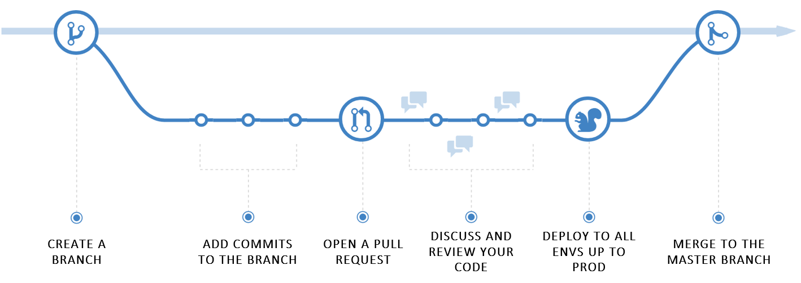

The environments and the deploy flow are detailed below:

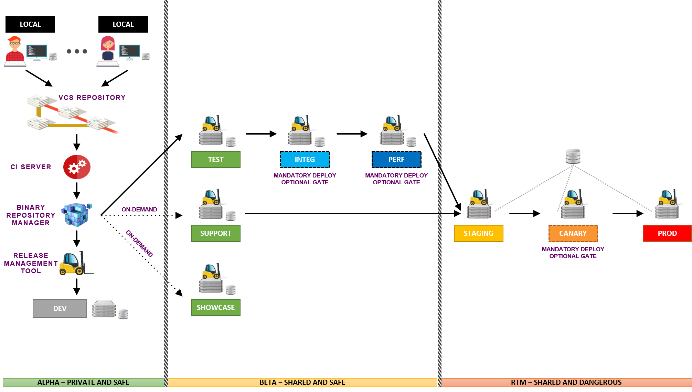

It is important to use environment-specific configurations and environment-agnostic binaries and deployment scripts

#### Quick time to market
The deploy flow and the environments it relies on allow to perform product development, showcases, troubleshooting and emergency incident resolution in a quick and non-blocking way.

#### Automated and optimized
The use of the same deployment script allow to detect errors early and to have repeatable builds, whereas the binary repository manager allow to save time on deploy.

#### Reliability on release
The [canary release](https://martinfowler.com/bliki/CanaryRelease.html) deployment strategy allows to release a new version of a software testing its behavior by directing traffic to a progressively increasing amount of users, with roll-back performed automatically on failure.

Changes in a distributed system should be backward compatible and performed in multiple steps, especially when changing the data model (rename = add new, use new, delete; delete = stop using, delete).

When a roll-back is unfeasible or dangerous the same flow should be used to perform a roll-forward.

#### Gradual feature releases
Sometimes there is the need to test a feature on a subset of the users: this is called A/B testing and can be implemented by means of traffic management and either [feature toggles](https://martinfowler.com/articles/feature-toggles.html) or the usage of different versions of the software.

## Introducing the new architecture

### Overview
Considering the engineering department structure and size it is recommended to use a cloud provider rather than managing a data center owned by Company X or servers owned by Company X and hosted in a remote data center.

There are some alternative approaches to introduce the new architecture and allow the business to keep evolving:
 - [FaaS](https://en.wikipedia.org/wiki/Function_as_a_service)
 - [PaaS](https://en.wikipedia.org/wiki/Platform_as_a_service)
 - [IaaS](https://en.wikipedia.org/wiki/Infrastructure_as_a_service)
 - [Kubernetes](https://kubernetes.io)

The AWS offering will be used as a reference, since it has the largest user base and the highest number of features.

### FaaS - AWS Lambda

The FaaS approach would allow minimum infrastructure management and only write code for the business logic, but it [cannot be used](https://medium.com/@PaulDJohnston/when-not-to-use-serverless-jeff-6d054d0e7098) for everything and minimizing [issues](https://epsagon.com/blog/how-to-minimize-aws-lambda-cold-starts/) reduces the benefits of using a managed service.

**Resiliency and reliability** comes for free since functions feature [automatic scaling](https://docs.aws.amazon.com/lambda/latest/dg/scaling.html)

RDS for MySQL features [cross-region read replicas](https://aws.amazon.com/blogs/aws/cross-region-read-replicas-for-amazon-rds-for-mysql/), vertical and horizontal (cannot be dynamic) [scalability](
https://aws.amazon.com/blogs/database/scaling-your-amazon-rds-instance-vertically-and-horizontally/) and [storage auto scaling](https://aws.amazon.com/about-aws/whats-new/2019/06/rds-storage-auto-scaling/).

**Reliability on release** is possible by means of [CodeDeploy Traffic Shifting](https://aws.amazon.com/about-aws/whats-new/2017/11/aws-lambda-supports-traffic-shifting-and-phased-deployments-with-aws-codedeploy)

**Gradual feature releases** can be performed with [Amazon Route53](https://aws.amazon.com/route53) nested domains to combine [routing policies](https://docs.aws.amazon.com/Route53/latest/DeveloperGuide/routing-policy.html) of type Geolocation/Geoproximity and Weighted.

### PaaS - AWS Elastic Beanstalk
The PaaS approach allow to have more control while benefitting from managed infrastructure, keeping the automation effort lower than with IaaS.

It relies on [Amazon EC2](https://aws.amazon.com/ec2) virtual machine [IaaS (Infrastructure as a Service)](https://en.wikipedia.org/wiki/Infrastructure_as_a_service) offering

**Resiliency and reliability** can be achieved with Amazon EC2 [Auto Scaling](https://aws.amazon.com/ec2/autoscaling) and by performing a [time-based scaling](https://aws.amazon.com/about-aws/whats-new/2015/05/aws-elastic-beanstalk-supports-time-based-scaling/) of AWS Elastic Beanstalk environments.

RDS for MySQL features [cross-region read replicas](https://aws.amazon.com/blogs/aws/cross-region-read-replicas-for-amazon-rds-for-mysql/), vertical and horizontal (cannot be dynamic) [scalability](
https://aws.amazon.com/blogs/database/scaling-your-amazon-rds-instance-vertically-and-horizontally/) and [storage auto scaling](https://aws.amazon.com/about-aws/whats-new/2019/06/rds-storage-auto-scaling/).

**Reliability on release** is possible by means of [Rolling deployments](https://docs.aws.amazon.com/elasticbeanstalk/latest/dg/using-features.rolling-version-deploy.html)

**Gradual feature releases** can be performed with [Amazon Route53](https://aws.amazon.com/route53) nested domains to combine [routing policies](https://docs.aws.amazon.com/Route53/latest/DeveloperGuide/routing-policy.html) of type Geolocation/Geoproximity and Weighted.

### IaaS - AWS EC2

The IaaS approach has very high costs and automation effort, since it relies on each and every bit of the infrastructure.

**Resiliency and reliability** can be achieved with Amazon EC2 [Auto Scaling](https://aws.amazon.com/ec2/autoscaling) and Auto Scaling [scheduled](https://docs.aws.amazon.com/autoscaling/ec2/userguide/schedule_time.html) scaling.

RDS for MySQL features [cross-region read replicas](https://aws.amazon.com/blogs/aws/cross-region-read-replicas-for-amazon-rds-for-mysql/), vertical and horizontal (cannot be dynamic) [scalability](
https://aws.amazon.com/blogs/database/scaling-your-amazon-rds-instance-vertically-and-horizontally/) and [storage auto scaling](https://aws.amazon.com/about-aws/whats-new/2019/06/rds-storage-auto-scaling/).

**Reliability on release** is possible with an advanced tool like [Spinnaker](https://www.spinnaker.io) or [customized](https://engineering.klarna.com/simple-canary-releases-in-aws-how-and-why-bf051a47fb3f) deployments.

**Gradual feature releases** can be performed with [Amazon Route53](https://aws.amazon.com/route53) nested domains to combine [routing policies](https://docs.aws.amazon.com/Route53/latest/DeveloperGuide/routing-policy.html) of type Geolocation/Geoproximity and Weighted.

### Kubernetes

Container orchestration, allows cost optimization with a good control on infrastructure but less automation effort compared to IaaS.

Unfortunately tooling and practices are not yet fully mature and the effort required with a little engineering team could impact on the evolution of the system in terms of business capabilities.

**Resiliency and reliability** can be achieved using the [cluster autoscaler](https://github.com/kubernetes/autoscaler/tree/master/cluster-autoscaler) and [autoscaling buffer pods](https://www.slideshare.net/try_except_/ensuring-kubernetes-cost-efficiency-across-many-clusters-devops-gathering-2019/44) whose creation and deletion can be scheduled.

The deploy flow take advantage of [Helm](https://helm.sh) and either [Jenkins X](https://jenkins-x.io) or [Spinnaker](https://www.spinnaker.io).

**Reliability on release** is possible by means of [Istio](https://istio.io/blog/2017/0.1-canary/) and [Flagger](https://flagger.app).

**Gradual feature releases** can be performed with [Istio](https://istio.io/docs/concepts/traffic-management) and [Flagger](https://flagger.app), used in combination with DNS traffic management.

### Adoption strategy
Kubernetes represents the perfect solution, but considering the engineering department structure and size it is advisable to consider it as a mid/long-term goal.

Furthermore, since the system has not reached its limits yet, it would be better to invest in a short-term solution that to increase stability and allow further growth while implementing the long-term solution in parallel: costs will be higher, but product development won't be stopped.

For the reasons above I suggest choosing AWS Lambda and, if possible, adopting services that will be available also when moving to Kubernetes.

The legacy system will be progressively migrated to the FaaS model decomposing front-end and back-end monoliths in smaller parts.

#### Microfrontends identification

## Logging and monitoring
[Observability](https://distributed-systems-observability-ebook.humio.com/) means, at a minimum, logging, application and business metrics monitoring, [distributed tracing](https://microservices.io/patterns/observability/distributed-tracing.html), alerting.

Usually multiple tools are needed to collect and analyze information.

### Metrics collection, storage and alerting
 - [Prometheus](https://prometheus.io) + [Grafana](https://grafana.com)
 - [InfluxDB](https://www.influxdata.com/products/influxdb-overview) + [Grafana](https://grafana.com)
 - [Elastic Metrics](https://www.elastic.co/solutions/metrics) + [Elastic APM](https://www.elastic.co/solutions/apm)

The suggestion is to start with [AWS Cloudwatch](https://aws.amazon.com/cloudwatch) and later move to Prometheus and Grafana, a very common choice, as a long-term solution.

### Logging
 - [FluentD](https://www.fluentd.org) + [Elasticsearch](https://www.elastic.co/products/elasticsearch) + [Kibana](https://www.elastic.co/products/kibana)
 - [Elastic Logging](https://www.elastic.co/solutions/logging)

The suggestion is to start with [Amazon CloudWatch Logs](https://docs.aws.amazon.com/AmazonCloudWatch/latest/logs/WhatIsCloudWatchLogs.html) or [Amazon Centralized Logging](https://aws.amazon.com/solutions/centralized-logging) and then move to FluentD + Elasticsearch + Kibana, the de facto standard when dealing with logs.

### Distributed tracing
 - [Jaeger](https://www.jaegertracing.io)
 - [Elastic APM](https://www.elastic.co/solutions/apm)

The suggestion is to start with [AWS X-Ray](https://aws.amazon.com/xray) and then move to Jaeger, the most complete tool implementing the [OpenTracing](https://opentracing.io) specification.